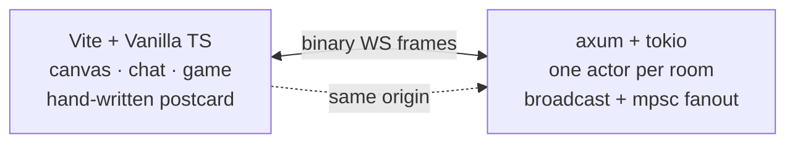
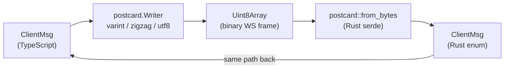
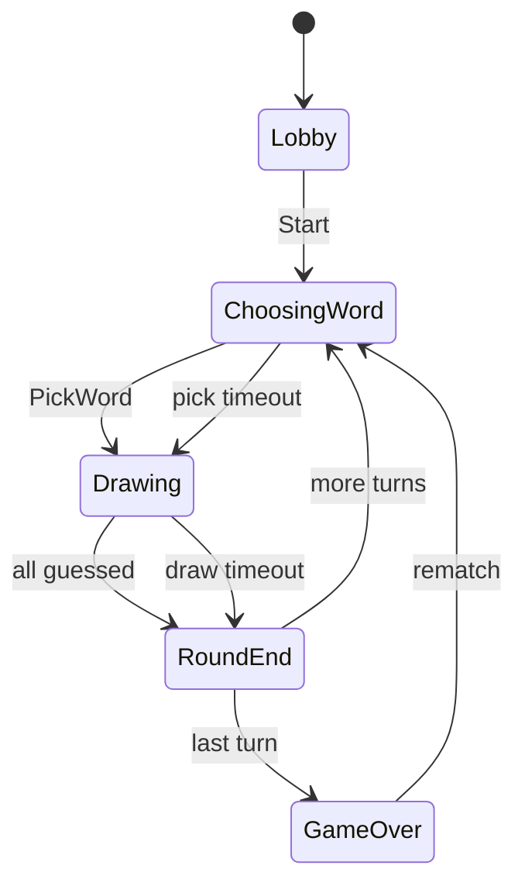
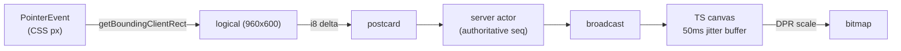

# pastel

Real-time, room-based collaborative drawing and word-guessing. No accounts,
no install, no dark patterns. Open two tabs and play.



One Rust binary serves the API, the WebSocket, and the static client.
One TypeScript bundle parses the exact same bytes Rust serialized.
Zero JSON anywhere on the hot path.

## Why this exists

Skribbl is great. It's also slow, ad-ridden, and the wire format is a
giant JSON message you can't reasonably extend. I wanted to:

1. **Take the protocol seriously.** Binary, versioned, validated, with
   byte-level cross-codec tests. The Rust side and the TypeScript side
   share fixture hex, so if either drifts the build screams.
2. **Take latency seriously.** Strokes should feel like ink. The whole
   pipeline (canvas → encode → WS → actor → fanout → decode → canvas)
   has to fit inside one animation frame on a local network, and stay
   under 1 ms p99 even with a thousand simulated clients.
3. **Take the actor model seriously.** Each room is one tokio task that
   owns its state. No locks on the hot path. No "global mutex over a
   HashMap." Rooms scale independently, fail independently.
4. **Take "no install" seriously.** Single Rust binary. No Postgres, no
   Redis, no message queue, no Kubernetes. You can run the whole thing
   on a 1 vCPU droplet.

It's also a meta-exercise in shipping a complete product in one sitting:
protocol, server, client, tests, CI, load test, docs. The constraints
force you to actually be done with each layer before moving on.

## What you can do

Open the landing page. Pick a name. Pick a mode. **Create new room**.
Share the URL. When a friend joins, click Start. The host owns the
game; everyone else sees "waiting for host" until you flip the switch.

Three modes:

| Mode      | Rounds | Word choices per turn |
|-----------|-------:|----------------------:|
| Sprint    | 3      | 7                     |
| Standard  | 5      | 5                     |
| Marathon  | 7      | 3                     |

Every player draws once per round. So a 5-round game with 4 players is
20 turns. Words come from a 1555-entry hand-graded list (1500 graded by
historical guess success rate from real skribbl logs, plus 55 hand-
picked memes spanning classics and 2024-2026 brainrot). Difficulty
steps up as the game progresses.

Hints reveal automatically while you draw: one letter at 60 s remaining,
another at 30 s, another at 10 s, capped at half the word's alpha length.
Guessers type into chat. First correct guess scores most, decaying by a
0.7 factor for each subsequent guesser. The drawer earns half the sum.

Quality-of-life things:

- The drawer sees the actual word; everyone else sees the mask, updating
  live as hints fire.
- Non-drawers can still scribble. Only they see it. Vent freely.
- Chat history survives reloads. The room's last 50 messages travel with
  the snapshot.
- Reload mid-round: you rejoin as a spectator with the canvas, mask,
  scoreboard, and timer all rehydrated. No refresh-induced amnesia.
- Late joiners are appended to the rotation. Their first turn is at the
  end of each remaining round.
- 6 brushes (pen, nib, pencil, brush, pastel, crayon), eraser, clear-
  for-everyone, 30 colours in three palettes (Basic / Performative /
  Queen).

## Run it locally

You need stable Rust (edition 2021), Node 20+, npm.

```sh
git clone <repo> && cd skribble
git config core.hooksPath .githooks
cd frontend && npm install && cd ..
```

Two terminals:

```sh
cargo run -p pastel-server
# listens on 0.0.0.0:7070
```

```sh
cd frontend && npm run dev
# Vite at http://127.0.0.1:5173, proxies /ws to the backend
```

Open `http://127.0.0.1:5173`. The landing form generates a room URL. Send
that URL to anyone to invite them.

## Engineering, opinionated

### Screw JSON

The wire is `postcard`-encoded binary. Each direction is a single enum:

```rust
pub enum ClientMsg { Hello(..), Stroke {..}, Chat {..}, Guess {..}, Game(..), Pong {..} }
pub enum ServerMsg { Welcome {..}, Stroke {..}, Chat {..}, Guess {..}, ... }
```

postcard is varint-based and field-order sensitive, so every message has
exactly one valid encoding. A 30-point stroke batch is **about 130 bytes**.
The equivalent JSON is roughly **600 bytes** before whitespace. Across a
10-room, 8-player game at 60 Hz, that's the difference between "this is
fine" and "you should worry about egress."

The TypeScript codec is hand-written, ~250 lines:



The Rust side asserts exact hex for a handful of canonical messages.
The TypeScript side asserts the **same** hex. If either drifts the build
fails on both. There is no other version-skew safety net, and there
doesn't need to be one.

### One actor per room. No locks.



Every room is a single `tokio` task that owns its state. The hot path
inside a room is lock-free:

```rust
loop {
    tokio::select! {
        biased;
        cmd = inbox.recv() => self.handle_cmd(cmd?),
        _ = sleep_until_or_pending(self.next_deadline()) => self.handle_deadline(),
    }
}
```

- **One** `mpsc::Receiver<RoomCmd>`: connection tasks push commands here.
- **One** `broadcast::Sender<Arc<ServerMsg>>`: room-wide messages fanned
  out to every connection task. Slow consumers get **dropped, not back-
  pressured**, so one laggy client cannot stall the room.
- **Per-player** `mpsc::Sender<Arc<ServerMsg>>`: unicast, for the drawer's
  secret word and word options.
- `Arc<ServerMsg>` so broadcast fanout is O(subscribers × atomic-inc),
  not O(subscribers × full clone of the payload).

The biased select gives commands strict priority over deadlines, which
means a player picking a word in the last 5 ms of the 15 s window never
loses a race with the auto-pick timer.

State machine, deadlines, scoring, mask, hints all live inside
[`crates/pastel-room/src/room.rs`](crates/pastel-room/src/room.rs) and
[`crates/pastel-room/src/game.rs`](crates/pastel-room/src/game.rs). Pure
helpers (mask construction, hint picking, scoring) are in `game.rs` with
their own unit tests; the actor only handles IO.

### Canvas: logical pixels, not CSS pixels

The drawing surface uses a fixed **logical 960 × 600** coordinate space.
The backing store is sized to `cssSize × devicePixelRatio` so strokes
stay crisp on Retina without changing what gets transmitted on the wire.
Pointer events are converted CSS → logical via `getBoundingClientRect`,
which fixes the classic "I draw here, it appears there" bug.



Strokes are smoothed with **quadratic Bezier midpoint interpolation**,
line width modulated by recent velocity. A persistent `completedStrokes`
model lets the canvas survive resize / DPI change / reload by replaying
itself into the new backing store. Remote strokes go through a ~50 ms
jitter buffer so a brief network hiccup doesn't cause stutter. Outgoing
strokes are chunked at 64 points per `Stroke` message so a fast hand on
a 240 Hz pointer doesn't blow the per-batch cap.

### Snapshots: one wire shape, two consumers

Every `Welcome` carries a full `RoomSnapshot`:

```rust
struct RoomSnapshot {
    players: Vec<Player>,
    completed: Vec<CompletedStroke>,  // the canvas, replayable
    chat: Vec<ChatLine>,              // last 50 messages
    game: GameSnapshot {              // current phase, mode, scores, host
        mode: GameMode,
        host: Option<PlayerId>,
        scores: Vec<(PlayerId, u32)>,
        phase: GamePhaseSnapshot { Lobby | ChoosingWord | Drawing { mask, deadline_ms } | ... },
    },
    seq: Seq,
}
```

Reload mid-round and you don't lose anything. The deadline is encoded
as **milliseconds-remaining-from-now-on-the-server**, so the client
doesn't need clock sync; it just adds the value to its local
`performance.now()`.

### Single binary, no infra

`pastel-server` is the deploy. It serves `/ws/:code`, `/healthz`,
`/metrics`, plus (in production builds) the static frontend. No
Postgres, no Redis, no message queue. Word lists are 1500 lines of
plain text in `crates/pastel-server/data/`, loaded once at startup.
Configuration via env vars (`PASTEL_WORDS_DIR`, `RUST_LOG`).

Redis (for cross-restart snapshot durability and rate-limit buckets
shared across nodes) and a rendezvous-hashing gateway (for horizontal
scale-out) are sketched out and easy to bolt on. Until the demand
exists, the simplicity of "one process owns everything" wins.

## Repo layout

```
crates/
  pastel-proto/      wire types, postcard codec, validation, fixtures
  pastel-room/       per-room actor, game state machine, scoring
  pastel-server/     axum + WebSocket binary, room registry, word loader
  pastel-loadtest/   simulated WS clients with HdrHistogram RTT
frontend/
  src/postcard.ts    hand-written codec (Reader / Writer)
  src/proto.ts       ClientMsg / ServerMsg encoders, decoders, types
  src/canvas.ts      pointer capture, Bezier smoothing, DPI, replay model
  src/ws.ts          WebSocket client, backoff reconnect, resume_from
  src/chat.ts        chat panel
  src/game.ts        client game state
  src/gameUI.ts      mode picker, word picker, podium overlays
  src/toolbar.ts     brushes, palette, clear
  src/landing.ts     name + mode + create-or-join
  src/main.ts        the wire-up
```

## Tests

```sh
cargo test --workspace        # 60+ tests
cd frontend && npm test       # 40 tests
```

The interesting ones, in order of paranoia:

- `crates/pastel-proto/tests/fixtures.rs` asserts byte-exact hex for
  canonical messages. `frontend/tests/postcard.test.ts` asserts the same
  hex. **Cross-codec divergence fails both suites.**
- `crates/pastel-proto/tests/round_trip.rs` proptests round-trip every
  `ClientMsg` and `ServerMsg` variant.
- `crates/pastel-room/tests/game.rs` drives a full Sprint game and a
  word-pick timeout via `tokio::time::pause` + `advance`. The state
  machine runs in virtual time, so an 80-second draw window costs zero
  wall-clock seconds.
- `crates/pastel-server/tests/server.rs` opens real WebSocket
  connections to an in-process axum server.

## Load test

`pastel-loadtest` is a Rust binary that spawns N tokio tasks, each one a
real WebSocket client. Clients are bucketed into rooms of `--per-room`
size. Each client sends a stroke every `1/rate` seconds. Round-trip
latency is the time from sending a `Stroke` to receiving the server's
broadcast echo of it (matched by `stroke_id`). Latencies go into an
HdrHistogram (3 sig figs).

### Numbers

Captured on a dev laptop (8 cores), release builds, `localhost` loop.

**Baseline: 200 clients, 40 rooms × 5 each, 30 s, 10 strokes/s**

```
wall time:       31.70s

connections
  attempted:     200
  established:   200 (100.0%)
  failed:        0

throughput
  strokes sent:       60000  (1892/s, target 60000)
  strokes recv:      299606  (9450/s, self=60000 other=239606)
  fanout ratio:  4.99x

stroke RTT (send → self-echo)
  samples:       60000
  min:              0.03 ms
  p50:              0.09 ms
  p95:              0.15 ms
  p99:              0.20 ms
  max:             42.05 ms
```

**1000 clients, 125 rooms × 8 each, 30 s, 10 strokes/s**

```
wall time:       32.50s

connections
  attempted:     1000
  established:   1000 (100.0%)
  failed:        0

throughput
  strokes sent:      300000  (9230/s, target 300000)
  strokes recv:     2396551  (73732/s, self=300000 other=2096551)
  fanout ratio:  7.99x

stroke RTT (send → self-echo)
  samples:       300000
  min:              0.03 ms
  p50:              0.13 ms
  p95:              0.27 ms
  p99:              0.35 ms
  max:             46.21 ms
```

Translation:

- **One thousand concurrent WebSocket clients**, fully connected, real
  binary frames over real TCP, sustained for 30 s.
- **2.4 million messages** broadcast over the run.
- **p99 round-trip is under half a millisecond.** "Send a stroke, see
  it echoed" is faster than a single animation frame at 60 Hz.
- Zero connection failures, zero bad frames, zero WebSocket errors.
- Per-stroke fanout is exactly `per-room`, which means the room actor
  fans out perfectly (no drops, no slow-consumer pruning kicked in).

The max latency of ~46 ms is the connection-setup tail; nothing during
steady state went above the p99.

### Run it yourself

```sh
cargo run --release -p pastel-server
```

```sh
cargo run --release -p pastel-loadtest -- \
    --clients 1000 --per-room 8 --duration 30 --rate 10
```

Flags:

| Flag          | Default                 | Effect                                              |
|---------------|-------------------------|-----------------------------------------------------|
| `--addr`      | `ws://127.0.0.1:7070`   | base WebSocket address                              |
| `--clients`   | 100                     | total simulated clients                             |
| `--per-room`  | 5                       | clients per room (rooms = ceil(clients/per_room))   |
| `--duration`  | 30                      | seconds in steady state                             |
| `--rate`      | 10                      | strokes/sec per client                              |
| `--quiet`     | off                     | suppress the per-2s progress lines                  |

### What this loadtest does NOT do

Honesty section.

- **It only tests Stroke fanout.** Chat, the game state machine, and
  guess scoring aren't exercised, so this is the "raw fanout under
  steady drawing load" picture, not the "real game" picture.
- **It opens all connections from one process.** Real users come over
  many machines, which changes the kernel TCP scheduling story.
- **It doesn't measure connection setup latency**, only steady-state
  RTT.
- **It's all localhost.** No WAN latency, no jitter, no NAT
  rebinding, no TLS handshake overhead.

These are follow-up concerns. The point of the existing numbers is to
prove the **architecture** isn't the bottleneck. When real-network
results disappoint, the cause will be one of: TCP/TLS overhead, geo-
distance, or per-connection memory at scale. Not the room actor.

## Lint, format, typecheck

```sh
cargo fmt --all
cargo clippy --workspace --all-targets -- -D warnings

cd frontend
npm run typecheck
npm run build       # vite production bundle
```

A pre-commit hook (installed via `git config core.hooksPath .githooks`)
runs `cargo fmt --check` on any commit that touches `.rs` files.

## CI

`.github/workflows/backend.yml` runs three jobs in parallel on push to
`main` and on PRs that touch backend paths:

| Job    | Command                                                  |
|--------|----------------------------------------------------------|
| fmt    | `cargo fmt --all -- --check`                             |
| clippy | `cargo clippy --workspace --all-targets -- -D warnings`  |
| test   | `cargo test --workspace --all-targets`                   |

All three must pass to merge.

`.github/workflows/frontend.yml` mirrors the same shape for the
frontend, path-filtered to `frontend/**`:

| Job        | Command                          |
|------------|----------------------------------|
| typecheck  | `npm run typecheck`              |
| test       | `npm test`                       |
| build      | `npm run build`                  |

## Wire protocol, briefly

One enum per direction (`ClientMsg`, `ServerMsg`). Variant indices and
field order are the wire contract; the Rust enum and the TypeScript
types must agree.

- Per-field caps: chat 256 B, name 32 B, points 64 / batch, frame 64 KB.
- Oversize frames close the connection with `Bye { BadFrame }`.
- Snapshots cap chat at 64 entries, completed strokes at 1024.
- New variants are added at the tail; existing indices are stable.
- Postcard. Always postcard. Never JSON.
